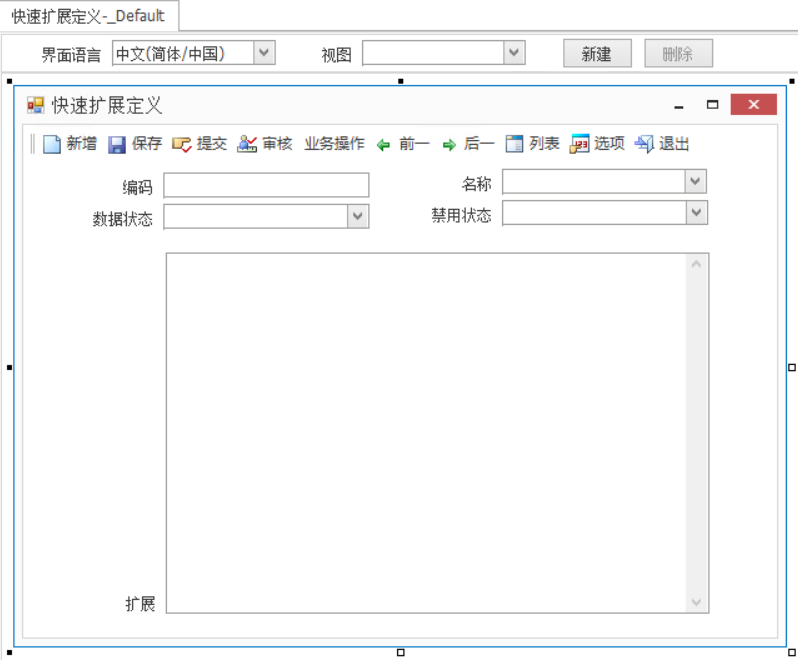
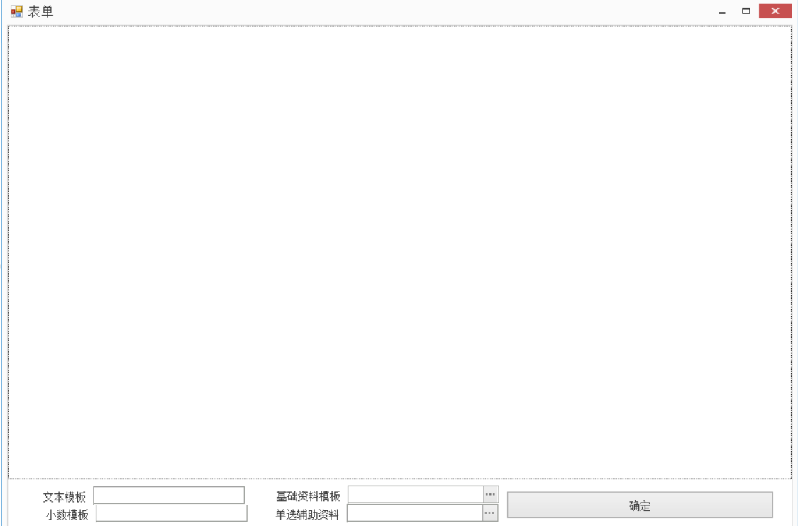
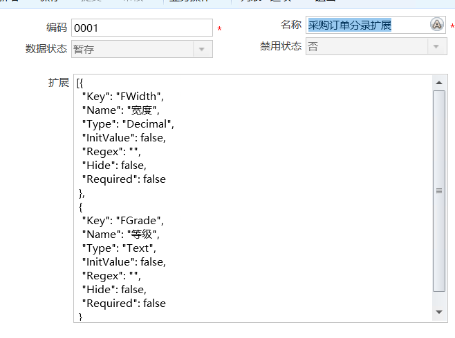
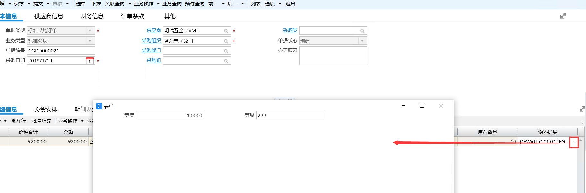

# Frh.K3.FastExtension 金蝶云星空快速扩展插件
K3Cloud快速扩展插件，用json描述界面元素并存储，能快速为单据扩展出字段，并兼容BOTP以及套打。K3Cloud虽然可以非常简单的添加字段，但是在字段多为存储场景下，此扩展插件还是比较符合业务需求。

## 插件环境

项目 | 版本
--- | :--:
IDE | Visual Studio Community 2017
K3Cloud | 7.2 
.Net Framework | 4.5
开发语言 | C#


## 初始化设置

1. Clone代码到本地，用VS编译dll，将dll文件放入K3Cloud的**WebSite\bin**目录
2. 重启IIS服务器
3. 打开**金蝶云星空集成开发平台**,进入自己的子系统，比如**基础管理-基础资料**
4. 新建基础资料**快速扩展定义**，标识为**WJ_Extension**,也可以可以自定义，请修改**Constant**常量,添加多行文本字段**FExtension**,长度2000，发布到菜单,如图：

5. 新建动态表单**单据扩展字段**，标识为**WJ_ExtensionUI**
    1. 上部分添加面板**F_WJ_Panel**用于显示动态控件
    2. 下部分放置文本模板控件**FModelText**、小数模板控件**FModelDecimal**、F8模板控件**FModelF8**、辅助资料模板控件**FModelAssistant**
    3. 放在确定按钮**FBtnOK**
    4. 注册插件**Frh.K3.FastExtension.ExtensionUI.ExtensionBillPlugIn**

    如图：
    ,发布到菜单

## 使用流程

以扩展采购订单分录为例

1. 打开基础资料**快速扩展定义**定义字段信息，例如定义了两个字段 宽度和等级，编码为0001：
```
[{
  "Key": "FWidth",
  "Name": "宽度",
  "Type": "Decimal",
  "InitValue": false,
  "Regex": "",
  "Hide": false,
  "Required": false
 },
 {
  "Key": "FGrade",
  "Name": "等级",
  "Type": "Text",
  "InitValue": false,
  "Regex": "",
  "Hide": false,
  "Required": false
 }
]
```
 

2. 打开采购订单，注册插件**Frh.K3.FastExtension.BeExtension.BeExtensionBillPlugIn**
3. 分录添加字段 **FExtension_0001**，必须以**FExtension_+快速扩展定义编码**的结构为字段名
4. 将**FExtension_0001**编辑风格设置为仅按钮编辑

打开采购订单如下：


## 扩展定义解析

```
    public class ExtensionItem
    {
        public string Key { get; set; }//字段名
        public string Name { get; set; }//显示的名称
        public string Type { get; set; }//类型，可以是文本、数字、枚举、F8
        public Boolean InitValue { get; set; }//值类型，可以是上游值过来的，也可以手工填写
        public string Regex { get; set; }//正则表达式，用于约束
        public string F8FormId { get; set; } //F8来源，如果type为F8，则这个必须有
        public string F8TableName { get; set; } //F8来源，如果type为F8，则这个必须有
        public string LookupObjectId { get; set; }//辅助资料来源，必须设置
        public Boolean Hide { get; set; }//是否隐藏
        public Boolean Required { get; set; }//是否必录
    }
```

## BOTP兼容

上游单据json为
```
{"FWidth":"1.0","FGrade":"222"}
```
在BOTP中，目标值设置为
```
INIT{"FWidth":"1.0","FGrade":"222"}
```
插件会将相同的字段赋值过去

## 套打兼容

套打使用动态字段，填入json中的key即可

## 后续开发

+ 支持可视化配置
+ 支持控件的隐藏、必录、控件值的正则表达式校验
+ 用Java重写提供对金蝶EAS的扩展

### 联系方式

如有不明白的地方，可以通过邮箱联系本人解答 frh0792@163.com